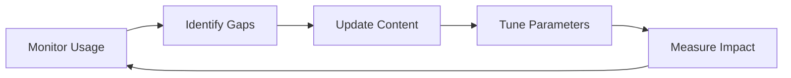

# Vector DB Agent Skill Implementation Plan

## Executive Summary

This plan outlines the systematic deployment of the Vector DB agent skill to achieve natural adoption and measurable value delivery. The approach focuses on seamless integration, iterative improvement, and data-driven optimization.

## Current State Analysis

### Assets Available
- ✅ Functional vector database (ChromaDB)
- ✅ MCP server with search_tools
- ✅ Agent SDK for direct access
- ✅ Agent skill implementation
- ✅ Installation scripts

### Problems to Solve
- ❌ Agents unaware of vector DB existence
- ❌ No natural discovery mechanism
- ❌ Zero current usage (0% adoption)
- ❌ Missing feedback loop
- ❌ No usage metrics

### Success Definition
- Agents naturally use vector DB during planning/research
- Measurable improvement in code consistency
- Reduced time spent on pattern discovery
- Positive developer feedback

## Implementation Phases

### Phase 1: Foundation (Day 1-2)
**Goal: Establish core infrastructure and initial deployment**

#### 1.1 Environment Preparation
```bash
# Verify ChromaDB is operational
cd ~/claude-code-vectordb
npm run chromadb:start

# Test connection
curl http://localhost:8000/api/v1

# Check existing data
tsx scripts/test-vector-api.ts
```

#### 1.2 Content Audit & Enhancement
- [ ] Review current vector DB content quality
- [ ] Identify high-value patterns to index
- [ ] Remove outdated or low-quality entries
- [ ] Add missing critical patterns

```bash
# Audit existing content
tsx scripts/audit-content.ts

# Quality metrics to check:
# - Relevance scores > 0.8
# - Recent updates (< 6 months old)
# - Proper categorization
# - Complete metadata
```

#### 1.3 Skill Installation
```bash
# Install in Claude skills directory
cd ~/claude-code-vectordb
./skills/vectordb-agent-skill/install.sh

# Verify installation
ls -la ~/.claude/skills/vectordb/
cat ~/.claude/skills/vectordb/SKILL.md

# Test skill directly
cd ~/.claude/skills/vectordb
tsx scripts/search.ts "test query"
```

#### 1.4 Initial Configuration
Create `~/.claude/skills/vectordb/config.json`:
```json
{
  "chromadb": {
    "host": "localhost",
    "port": 8000,
    "ssl": false
  },
  "collection": "project-docs",
  "defaults": {
    "limit": 5,
    "threshold": 0.7
  },
  "queryExpansion": true,
  "telemetry": {
    "enabled": true,
    "logPath": "~/.claude/skills/vectordb/usage.log"
  }
}
```

### Phase 2: Integration Testing (Day 3-4)
**Goal: Validate skill functionality in real scenarios**

#### 2.1 Test Scenarios
Create test cases for common patterns:

| Scenario | Trigger Phrase | Expected Result |
|----------|---------------|-----------------|
| Architecture Search | "how should I structure the auth module" | Returns auth patterns |
| Pattern Discovery | "find examples of error handling" | Shows error patterns |
| Convention Check | "what's our API naming convention" | Returns standards docs |
| Implementation Research | "how did we implement caching" | Shows cache examples |
| Fresh Start | "no existing patterns for X" | Returns empty, doesn't crash |

#### 2.2 Test Script
```typescript
// test-skill-integration.ts
const testCases = [
  { query: "authentication", expectedCategories: ["auth", "security"] },
  { query: "database schema", expectedCategories: ["database", "models"] },
  { query: "gibberish123xyz", expectedResults: 0 },
];

for (const test of testCases) {
  console.log(`Testing: ${test.query}`);
  const result = await runSkillSearch(test.query);
  validateResult(result, test);
}
```

#### 2.3 Performance Benchmarking
```bash
# Measure response times
time tsx ~/.claude/skills/vectordb/scripts/search.ts "auth"

# Target metrics:
# - P50: < 100ms
# - P95: < 500ms
# - P99: < 1000ms
```

#### 2.4 Error Handling Validation
- Test with ChromaDB stopped
- Test with empty collection
- Test with malformed queries
- Test with network issues

### Phase 3: Soft Launch (Day 5-7)
**Goal: Deploy to limited projects for real-world validation**

#### 3.1 Pilot Project Selection
Choose 2-3 projects with:
- Active development
- Good documentation coverage in vector DB
- Variety of technical challenges

#### 3.2 Developer Onboarding
Create minimal onboarding:
```markdown
# Quick Start
The vector DB skill is now available. When planning or researching,
the agent will automatically search for relevant patterns.

No action required - it just works.

Try: "I need to implement user preferences"
```

#### 3.3 Usage Monitoring
Implement basic telemetry:
```typescript
// In skill's search.ts
function logUsage(query: string, resultCount: number, responseTime: number) {
  const entry = {
    timestamp: new Date().toISOString(),
    query,
    resultCount,
    responseTime,
    expanded: queryWasExpanded,
  };

  fs.appendFileSync('~/.claude/skills/vectordb/usage.log',
    JSON.stringify(entry) + '\n'
  );
}
```

#### 3.4 Feedback Collection
- Monitor for skill activation
- Track which results agents reference
- Note patterns that get implemented
- Identify failed searches

### Phase 4: Optimization (Week 2)
**Goal: Improve based on real usage data**

#### 4.1 Query Analysis
```typescript
// analyze-queries.ts
const logs = readUsageLogs();

// Find common patterns
const queryPatterns = extractPatterns(logs);

// Identify failed searches (0 results)
const failures = logs.filter(l => l.resultCount === 0);

// Calculate success rate
const successRate = (logs.length - failures.length) / logs.length;
```

#### 4.2 Content Gap Analysis
Based on failed queries:
1. Identify missing documentation
2. Add high-demand patterns
3. Improve existing content
4. Update metadata/categories

#### 4.3 Query Expansion Tuning
```typescript
// Enhance expansion dictionary based on usage
const expansions = {
  // Add discovered synonyms
  'auth': [...existing, ...newTermsFromLogs],
  'user': ['account', 'member', 'person', 'identity'],
  // Add domain-specific terms
  'preferences': ['settings', 'config', 'options'],
};
```

#### 4.4 Relevance Threshold Adjustment
```typescript
// Find optimal threshold
const thresholds = [0.6, 0.65, 0.7, 0.75, 0.8];
for (const threshold of thresholds) {
  const results = await testWithThreshold(threshold);
  console.log(`Threshold ${threshold}: precision=${results.precision}, recall=${results.recall}`);
}
```

### Phase 5: Full Rollout (Week 3)
**Goal: Deploy to all projects with proven configuration**

#### 5.1 Universal Deployment
```bash
# Script to add to all projects
for project in ~/Projects/*; do
  if [ -d "$project/.git" ]; then
    echo "Vector DB available via agent skill" > "$project/.ai-context"
    echo "Added context to $project"
  fi
done
```

#### 5.2 Documentation Update
Update all READMEs:
```markdown
## AI Agent Assistance
This project integrates with a vector database containing:
- Architecture patterns
- Code conventions
- Implementation examples
- Best practices

Agents automatically search when planning or researching.
```

#### 5.3 Team Communication
Share with team:
- Usage statistics
- Success stories
- Time saved metrics
- Pattern reuse examples

#### 5.4 Continuous Improvement Loop


### Phase 6: Long-term Evolution (Month 2+)
**Goal: Establish sustainable improvement cycle**

#### 6.1 Advanced Features
- [ ] Multi-collection support (per project)
- [ ] Personalized ranking based on developer
- [ ] Auto-indexing of new patterns
- [ ] Cross-project pattern detection

#### 6.2 Integration Expansion
- [ ] IDE extension with inline hints
- [ ] Git hook integration for pattern capture
- [ ] CI/CD pattern validation
- [ ] Documentation auto-generation

#### 6.3 Machine Learning Enhancements
- [ ] Query intent classification
- [ ] Result re-ranking based on usage
- [ ] Automatic synonym discovery
- [ ] Pattern quality scoring

## Rollback Procedures

### If Issues Arise

#### Level 1: Soft Disable
```bash
# Rename skill to disable
mv ~/.claude/skills/vectordb ~/.claude/skills/vectordb.disabled
```

#### Level 2: Remove Skill
```bash
# Complete removal
rm -rf ~/.claude/skills/vectordb
```

#### Level 3: Fall Back to Manual
Keep vector DB running but require explicit queries:
```typescript
// Agents use direct connection
import { ChromaClient } from 'chromadb';
```

## Success Metrics & KPIs

### Week 1 Targets
| Metric | Target | Measurement |
|--------|--------|-------------|
| Skill Activation Rate | 20% of sessions | Usage logs |
| Query Success Rate | 70% return results | Result count > 0 |
| Response Time P95 | < 500ms | Performance logs |
| Developer Satisfaction | Positive feedback | Surveys |

### Month 1 Targets
| Metric | Target | Measurement |
|--------|--------|-------------|
| Adoption Rate | 60% of planning tasks | Session analysis |
| Pattern Reuse | 30% increase | Code similarity |
| Time to Solution | 25% reduction | Task completion time |
| Content Coverage | 80% of domains | Gap analysis |

### Quarter 1 Targets
| Metric | Target | Measurement |
|--------|--------|-------------|
| Full Adoption | 90% of eligible tasks | Automated tracking |
| ROI | 40% time savings | Time tracking |
| Quality Impact | Fewer pattern violations | Code review metrics |
| Knowledge Growth | 500+ patterns indexed | Database size |

## Risk Mitigation

### Technical Risks

| Risk | Likelihood | Impact | Mitigation |
|------|------------|---------|------------|
| ChromaDB downtime | Low | High | Auto-restart script, fallback to cache |
| Slow queries | Medium | Medium | Query optimization, result caching |
| Poor relevance | Medium | High | Continuous tuning, user feedback |
| Skill conflicts | Low | Low | Namespace isolation, version control |

### Adoption Risks

| Risk | Likelihood | Impact | Mitigation |
|------|------------|---------|------------|
| Low usage | Medium | High | Better triggers, success stories |
| Resistance to change | Low | Medium | Gradual rollout, clear value |
| Content gaps | High | Medium | Proactive indexing, automation |
| Overreliance | Low | Low | Encourage critical thinking |

## Resource Requirements

### Technical Resources
- ChromaDB server (always running)
- 2GB disk space for vector storage
- 100MB for skill and logs
- Network: localhost only

### Time Investment
- Phase 1-2: 4 hours setup
- Phase 3-4: 2 hours/week monitoring
- Phase 5-6: 1 hour/week maintenance

### Team Involvement
- Developer: Implementation and tuning
- Team Lead: Success metrics review
- All Developers: Feedback and usage

## Implementation Checklist

### Day 1
- [ ] Start ChromaDB
- [ ] Audit vector DB content
- [ ] Install skill
- [ ] Configure settings
- [ ] Test basic search

### Day 2
- [ ] Run integration tests
- [ ] Benchmark performance
- [ ] Fix any issues
- [ ] Document setup

### Day 3-4
- [ ] Deploy to pilot projects
- [ ] Monitor initial usage
- [ ] Collect feedback
- [ ] Address issues

### Week 1 Review
- [ ] Analyze usage logs
- [ ] Calculate success metrics
- [ ] Identify improvements
- [ ] Plan optimizations

### Week 2
- [ ] Implement improvements
- [ ] Expand deployment
- [ ] Refine content
- [ ] Update documentation

### Week 3
- [ ] Full rollout
- [ ] Team communication
- [ ] Success celebration
- [ ] Plan next phase

## Conclusion

This implementation plan provides a structured approach to deploying the Vector DB agent skill with:
- **Minimal friction** for developers
- **Natural adoption** by agents
- **Measurable value** delivery
- **Continuous improvement** cycle

The phased approach reduces risk while building confidence through real-world validation. Success depends on content quality, performance, and natural integration rather than forced adoption.

---

*Plan Version: 1.0*
*Created: November 2024*
*Status: Ready for Execution*
*Next Review: After Phase 3 Completion*